<div align="center">

# IndustryPM: Industry Project Management Platform

**A microservices platform for planning industrial projects, tracking work on a Kanban board, and notifying people automatically when tasks are assigned or moved.**


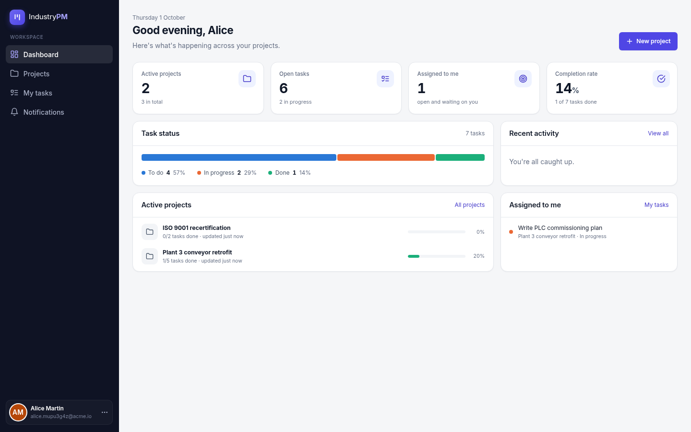

</div>

---

## Table of contents

1. [Overview](#overview)
2. [Features](#features)
3. [Screenshots](#screenshots)
4. [Architecture](#architecture)
5. [Tech stack](#tech-stack)
6. [Repository structure](#repository-structure)
7. [Quick start (Docker)](#quick-start-docker)
8. [Guided demo](#guided-demo)
9. [Running services individually (without Docker)](#running-services-individually-without-docker)
10. [Configuration](#configuration)
11. [API reference](#api-reference)
12. [Security model](#security-model)
13. [Permissions](#permissions)
14. [Automatic notifications](#automatic-notifications)
15. [Data model](#data-model)
16. [Frontend architecture](#frontend-architecture)
17. [Testing](#testing)
18. [DevOps: containers, Kubernetes, infrastructure](#devops-containers-kubernetes-infrastructure)
19. [Troubleshooting](#troubleshooting)
20. [Known limitations and roadmap](#known-limitations-and-roadmap)
21. [Contributing](#contributing)

---

## Overview

IndustryPM helps teams run industrial projects, such as a conveyor retrofit, an ISO recertification or a warehouse system rollout, from one place:

- **Projects** group related work. Their progress is calculated from their tasks.
- **Tasks** live on a **Kanban board** (To do → In progress → Done) and can be assigned to a teammate by email.
- **Notifications** are sent automatically. The assignee hears about new work, and the creator hears when the assignee moves it.

Under the hood it is a set of **independent Spring Boot microservices**. Each one owns its own database. They sit behind an **API gateway** and are consumed by an **Angular** single-page app. The whole system starts with one `docker compose` command and has **Kubernetes manifests (EKS)** and **Terraform** (CI and monitoring servers on AWS) for deployment.

---

## Features

### For users
| Area | What you can do |
|------|-----------------|
| **Accounts** | Register (you are signed in immediately) and sign in. A password-strength meter and inline validation help along the way. When a session expires you are signed out cleanly and sent back to the page you were on after signing in again. |
| **Dashboard** | Personal greeting and key figures (active projects, open tasks, tasks assigned to you, completion rate). A task-status breakdown chart, active projects with progress bars, your open tasks and recent activity. |
| **Projects** | Create, edit, complete, archive, reopen and delete projects. Search, filter by status (with counts), sort by update date, name or progress. |
| **Kanban board** | Drag and drop tasks between columns. The board updates instantly and rolls back if the server refuses. You can also filter tasks, show only *assigned to me* or *created by me*, add tasks straight into any column, and open a task to edit it. |
| **My tasks** | Every task assigned to you or created by you, across all projects, grouped by status, with an inline status picker. |
| **Notifications** | Unread badge in the sidebar (refreshed every 30 s), unread filter, mark one or all as read, and send a short message to a teammate. |
| **Experience** | Light and dark themes (follow the OS or choose one), responsive layout down to phone width with a slide-out menu, skeleton loaders, empty states, error states with *Retry*, toasts and confirmation dialogs. Keyboard support (Esc closes dialogs, focus is managed). |

### Engineering highlights
- **Database per service.** Each service has its own PostgreSQL database and user, with schemas versioned by **Flyway**.
- **Stateless JWT authentication.** `auth-service` signs tokens. Every other service checks them independently with the shared secret, so no service calls another just to authenticate a request.
- **Consistent `401` semantics.** A missing or expired token always returns `401 Unauthorized` (never a misleading `403`). The frontend uses this to end the session.
- **Event-driven notifications.** Notifications are sent only after the database transaction commits, on a best-effort basis: if notification-service is down, a task change still succeeds. See [Automatic notifications](#automatic-notifications).
- **Modern Angular.** Standalone components, signals, `OnPush` change detection, the new control-flow syntax (`@if`, `@for`), lazy-loaded routes, functional guards and interceptors, and the Angular CDK for drag and drop.
- **No UI framework.** A small custom design system (CSS design tokens) with accessible colours. The task-status colours were checked for colour-blind safety.
- **Tested at three levels.** Unit tests (JUnit and Mockito; Jasmine and Karma), integration tests against a real PostgreSQL started by **Testcontainers**, and a browser end-to-end run against the full Docker stack.

---

## Screenshots

| Sign in | Projects |
|---|---|
| 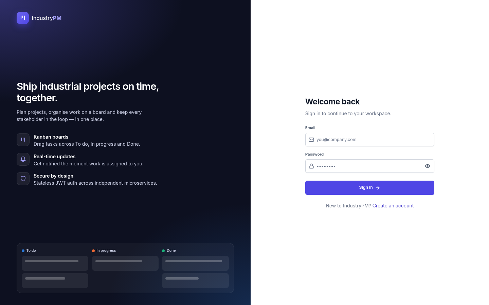 | 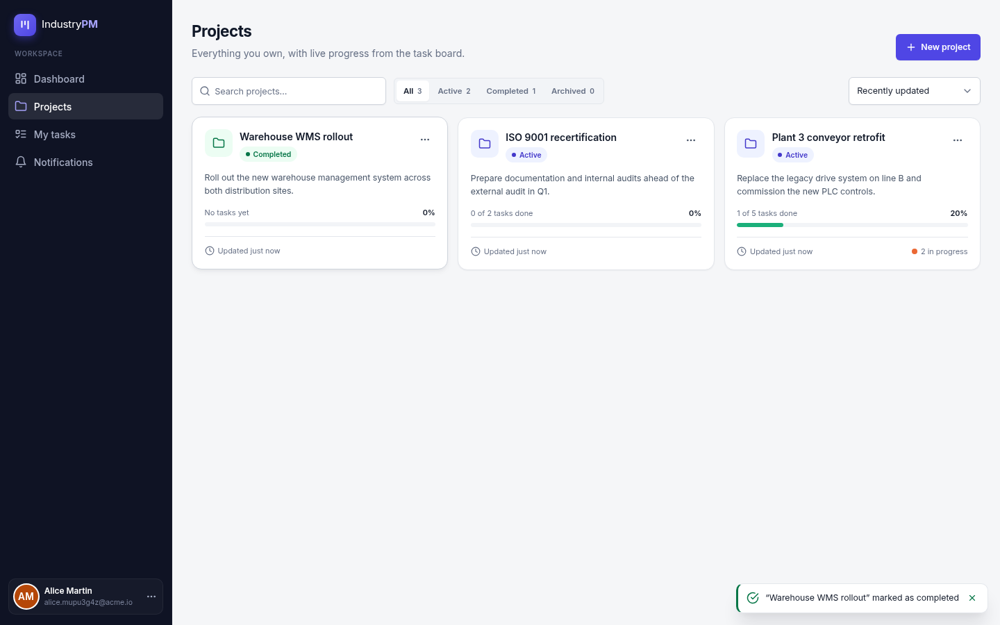 |

| Kanban board | Kanban board (dark mode) |
|---|---|
| 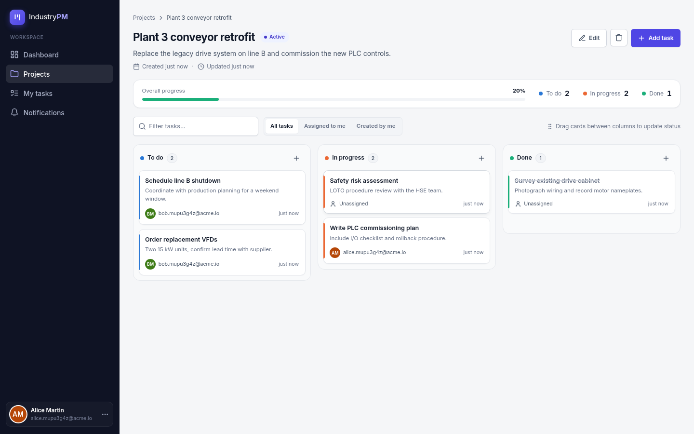 | 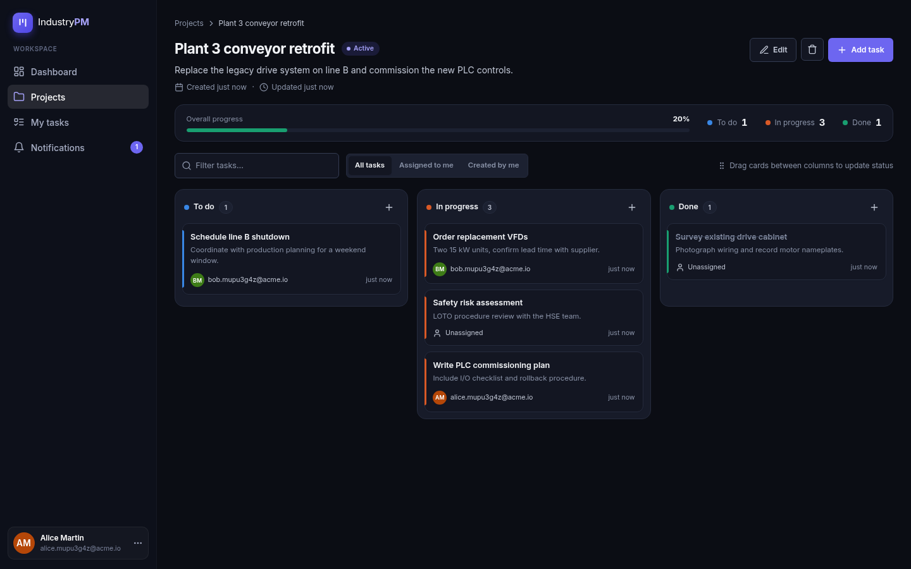 |

| Task dialog | My tasks |
|---|---|
| 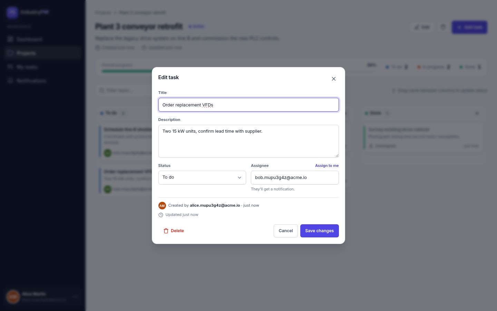 | 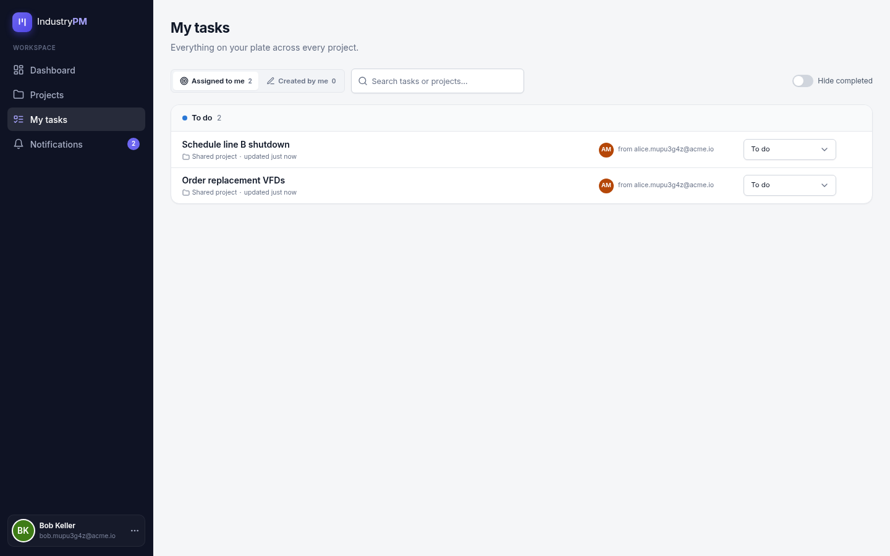 |

| Notifications | Mobile |
|---|---|
| 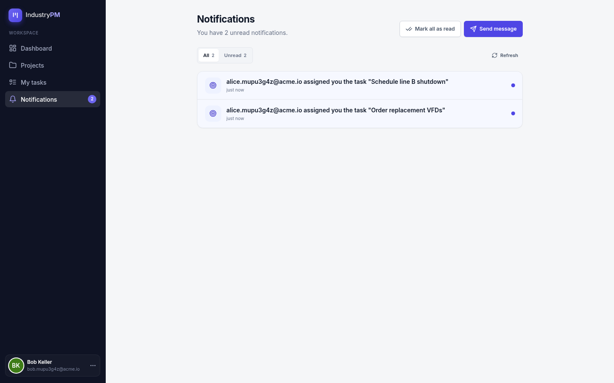 | 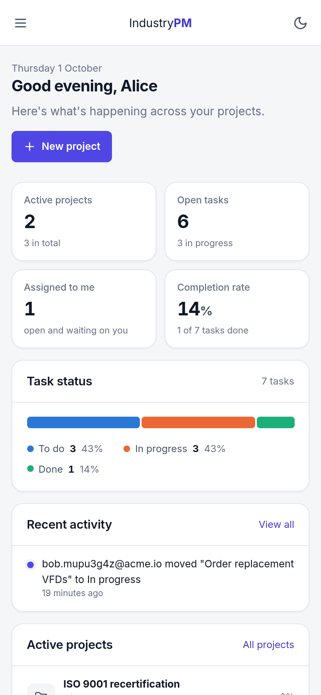 |

---

## Architecture

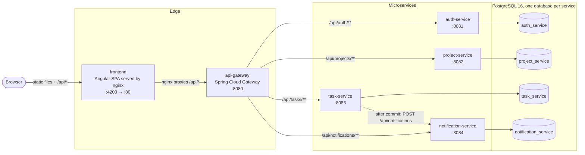

**How a request flows**

1. The browser loads the Angular app from the `frontend` container (nginx).
2. API calls use a **relative** `/api/...` URL. nginx proxies them, inside the server, to `api-gateway:8080`, so the browser only ever talks to one origin and there are no cross-origin (CORS) problems in production.
3. The gateway routes by path prefix to the right service. It forwards the full path unchanged.
4. The service validates the JWT from the `Authorization: Bearer …` header with the shared secret, runs the request, and reads or writes **its own** database.

**Design decisions**

| Decision | Why |
|---|---|
| One database per service | Services can be deployed and changed independently. No service reads another's tables. |
| Shared JWT secret instead of a call to auth-service | Every service checks tokens locally, so auth-service is not on the path of every request. |
| Users identified by email in the JWT `sub` claim | Project, task and notification records store the owner, creator or assignee as an email address, so no user lookup across services is needed. |
| Notifications sent after commit and allowed to fail | Notifications are secondary to the task change. A notification outage must never roll back or block a task update. |
| nginx reverse proxy in front of the SPA | Same-origin API calls, the same image works in Docker and Kubernetes, and the backend is never exposed to the browser directly. |

---

## Tech stack

| Layer | Technology |
|---|---|
| Backend language and framework | Java 21, Spring Boot 3.3 (Web, Security, Data JPA, Validation) |
| API gateway | Spring Cloud Gateway (reactive), Spring Boot Actuator |
| Auth | Spring Security (stateless), BCrypt password hashing, JJWT 0.12 (HMAC-signed JWT) |
| Persistence | PostgreSQL 16, Hibernate (`ddl-auto: validate`), Flyway migrations |
| Inter-service calls | Spring `RestClient`, `@TransactionalEventListener` |
| Backend testing | JUnit 5, Mockito, AssertJ, Spring MockMvc, Testcontainers (PostgreSQL) |
| Frontend | Angular 18 (standalone components, signals, new control flow), RxJS 7, Angular CDK drag and drop |
| Styling | Hand-written CSS design system with design tokens; light and dark themes; Inter font |
| Frontend testing | Jasmine, Karma, headless Chrome |
| Packaging | Multi-stage Dockerfiles (Maven → JRE Alpine; Node → nginx Alpine) |
| Local orchestration | Docker Compose |
| Deployment | Kubernetes (AWS EKS) manifests |
| Infrastructure | Terraform (AWS EC2): Jenkins + SonarQube + Trivy server, Prometheus + Node Exporter monitoring server |

---

## Repository structure

```
.
├── auth-service/            Registration, login, JWT issuing, current-user profile
├── project-service/         Projects (owner-scoped CRUD)
├── task-service/            Tasks, assignee rules, notification events
│   └── src/main/java/.../notification/   TaskNotificationEvent + NotificationPublisher
├── notification-service/    Per-user notifications, read/unread
├── api-gateway/             Spring Cloud Gateway routes + CORS
├── frontend/                Angular 18 single-page app + nginx config
│   └── src/app/
│       ├── core/            services, guards, interceptor, models
│       ├── shared/          reusable UI components (modal, icons, forms, toasts…)
│       ├── layout/          authenticated app shell (sidebar)
│       └── pages/           dashboard, projects, project-detail, my-tasks, notifications, auth
├── db/init-multi-db.sql     Creates one database + user per service on first Postgres start
├── docker-compose.yml       Runs the whole platform locally
├── kubernetes/              EKS manifests (namespace, config, secrets, deployments, services)
├── Terraform/
│   ├── Jenkins-SonarQube-VM/   EC2 server for Jenkins, SonarQube (Docker) and Trivy
│   └── Monitoring-Server/      EC2 server for Prometheus and Node Exporter (Grafana steps documented)
└── docs/screenshots/        Images used in this README
```

Each backend service follows the same layout:

```
<service>/src/main/java/com/industrypm/<service>/
├── config/       SecurityConfig (stateless filter chain, 401 entry point)
├── controller/   REST endpoints
├── dto/          request/response records with Bean Validation
├── entity/       JPA entities
├── exception/    domain exceptions + GlobalExceptionHandler (consistent JSON errors)
├── repository/   Spring Data repositories
├── security/     JwtService + JwtAuthFilter
└── service/      business logic
```

---

## Quick start (Docker)

### Prerequisites
- **Docker** with the Compose plugin (`docker compose version`)
- About **4 GB of free RAM** for 6 JVM and nginx containers plus Postgres
- These ports free: `4200`, `8080`–`8084`, `5433`

### Start everything

```bash
git clone git@github.com:CHAKRAbdedaym/Industry-project-management-platform.git
cd Industry-project-management-platform
docker compose up -d --build
```

The first build downloads Maven and npm dependencies and takes a few minutes. After the containers start, the Spring services need **about a minute** to run their migrations and start up.

Check that it's ready:

```bash
docker compose ps
# A 401 here means the whole chain nginx → gateway → auth-service → Postgres is answering
curl -s -o /dev/null -w '%{http_code}\n' -X POST http://localhost:4200/api/auth/login \
  -H 'Content-Type: application/json' -d '{"email":"x@y.z","password":"wrong-password"}'
```

Then open **http://localhost:4200** and create an account.

### What's running

| Container | URL / port | Purpose |
|---|---|---|
| `ipmp-frontend` | http://localhost:4200 | The web app (nginx serving Angular, proxying `/api`) |
| `ipmp-api-gateway` | http://localhost:8080 | API entry point (also usable from Postman or curl) |
| `ipmp-auth-service` | localhost:8081 | Auth service (direct access for debugging) |
| `ipmp-project-service` | localhost:8082 | Project service |
| `ipmp-task-service` | localhost:8083 | Task service |
| `ipmp-notification-service` | localhost:8084 | Notification service |
| `ipmp-postgres` | localhost:5433 | PostgreSQL (user `postgres` / password `postgres`) |

### Everyday commands

```bash
docker compose logs -f task-service        # follow one service's logs
docker compose up -d --build frontend      # rebuild + restart one service after a change
docker compose down                        # stop (keeps data)
docker compose down -v                     # stop and DELETE all data (fresh start)
```

---

## Guided demo

A 5-minute walkthrough that shows every feature, including how the services work together:

1. **Register Alice.** Open http://localhost:4200, choose *Create an account*, and register `alice@acme.io`. You land on her dashboard.
2. **Register Bob in a private window.** Register `bob@acme.io` the same way, then sign out.
3. **Create a project.** As Alice, choose *New project*, for example *Plant 3 conveyor retrofit*. You go straight to its board.
4. **Add tasks.** Use the **+** on each column to add tasks to To do, In progress and Done. On one task, set **Assignee** to `bob@acme.io`.
5. **Drag and drop.** Drag a card to another column. The progress bar and counters update, and the change is still there after a page reload.
6. **Bob gets notified.** Sign in as Bob. The **Notifications** badge shows *1*: *"alice@acme.io assigned you the task …"*. This notification was created by task-service calling notification-service.
7. **The assignee moves the task.** Bob opens **My tasks** and changes the task's status. If he opens the task, the details are read-only because only the creator can edit them.
8. **Alice gets notified.** Sign back in as Alice: *"bob@acme.io moved … to In progress"*.
9. **Polish.** Toggle dark mode from the avatar menu, narrow the window to phone width, and open an unknown URL to see the 404 page.

---

## Running services individually (without Docker)

Useful when developing one service in an IDE.

**Prerequisites:** JDK 21, Maven 3.9+, Node 20+, npm.

1. **Start only the database** (all services default to `localhost:5433`):
   ```bash
   docker compose up -d postgres
   ```
2. **Run the backend services**, each in its own terminal:
   ```bash
   cd auth-service         && mvn spring-boot:run   # :8081
   cd project-service      && mvn spring-boot:run   # :8082
   cd task-service         && mvn spring-boot:run   # :8083
   cd notification-service && mvn spring-boot:run   # :8084
   cd api-gateway          && mvn spring-boot:run   # :8080
   ```
3. **Run the frontend dev server** with live reload:
   ```bash
   cd frontend
   npm install
   npm start          # http://localhost:4200, calls the API at http://localhost:8080/api
   ```
   In development the browser calls the gateway directly (`src/environments/environment.ts`). The gateway's CORS config allows `http://localhost:4200`.

---

## Configuration

Every setting has a working local default and can be overridden with an environment variable.

### Shared by the Java services

| Variable | Used by | Default | Description |
|---|---|---|---|
| `DB_URL` | auth, project, task, notification | `jdbc:postgresql://localhost:5433/<service>_service` | JDBC URL of the service's own database |
| `DB_USERNAME` | same | `<service>_service` | Database user |
| `DB_PASSWORD` | same | `<service>_service` | Database password |
| `JWT_SECRET` | same | `dev-only-secret-key-change-me-please-32-bytes-min` | HMAC key. **It must be identical in all four services.** Use at least 32 bytes. |

### Service-specific

| Variable | Service | Default | Description |
|---|---|---|---|
| `JWT_EXPIRATION_MINUTES` | auth-service | `60` | Access-token lifetime |
| `NOTIFICATION_SERVICE_URL` | task-service | `http://localhost:8084` | Where task events are delivered |
| `AUTH_SERVICE_URL` | api-gateway | `http://localhost:8081` | Route target for `/api/auth/**` |
| `PROJECT_SERVICE_URL` | api-gateway | `http://localhost:8082` | Route target for `/api/projects/**` |
| `TASK_SERVICE_URL` | api-gateway | `http://localhost:8083` | Route target for `/api/tasks/**` |
| `NOTIFICATION_SERVICE_URL` | api-gateway | `http://localhost:8084` | Route target for `/api/notifications/**` |

### Frontend

| File | Setting | Value |
|---|---|---|
| `frontend/src/environments/environment.ts` | `apiBaseUrl` (dev server) | `http://localhost:8080/api` |
| `frontend/src/environments/environment.prod.ts` | `apiBaseUrl` (Docker/K8s build) | `/api` (same origin, proxied by nginx) |
| `frontend/nginx.conf` | `/api/` proxy target | `http://api-gateway:8080/api/` |

> ⚠️ **The defaults are for development only.** Before any real deployment, change `JWT_SECRET` and every database password, and store them in a secrets manager rather than in Git.

---

## API reference

All endpoints are reached through the gateway at `http://localhost:8080` (or `http://localhost:4200` through nginx). Except for register and login, every endpoint requires the header `Authorization: Bearer <accessToken>`.

### Error format (all services)

```json
{
  "timestamp": "2026-10-01T17:53:49.413Z",
  "status": 400,
  "error": "Bad Request",
  "message": "title: must not be blank"
}
```

| Status | Meaning |
|---|---|
| `400` | Validation failed, invalid status value, or an assignee tried to edit task details |
| `401` | Missing, malformed or expired token, or wrong login credentials |
| `404` | The resource doesn't exist **or isn't yours**. Resources owned by someone else are deliberately reported as not found so their existence isn't revealed. |
| `409` | Email already registered |

### Auth: `/api/auth`

| Method | Path | Auth | Body | Response |
|---|---|---|---|---|
| `POST` | `/api/auth/register` | — | `{ "email", "password" (8–100 chars), "fullName" }` | `201` `{ id, email, fullName, role }` |
| `POST` | `/api/auth/login` | — | `{ "email", "password" }` | `200` `{ accessToken, expiresIn }` (seconds) |
| `GET` | `/api/auth/me` | ✔ | — | `200` `{ id, email, fullName, role }` |

### Projects: `/api/projects`

Projects are visible only to their owner.

| Method | Path | Body | Response |
|---|---|---|---|
| `POST` | `/api/projects` | `{ "name" (≤255), "description"? (≤2000) }` | `201` Project |
| `GET` | `/api/projects` | — | `200` Project[] (yours) |
| `GET` | `/api/projects/{id}` | — | `200` Project |
| `PUT` | `/api/projects/{id}` | `{ "name", "description"?, "status": "ACTIVE" \| "COMPLETED" \| "ARCHIVED" }` | `200` Project |
| `DELETE` | `/api/projects/{id}` | — | `204` |

`Project = { id, name, description, status, ownerEmail, createdAt, updatedAt }`

### Tasks: `/api/tasks`

A task is visible to its **creator** and its **assignee**.

| Method | Path | Body / params | Response |
|---|---|---|---|
| `POST` | `/api/tasks` | `{ "projectId", "title" (≤255), "description"?, "assigneeEmail"? }` | `201` Task (status `TODO`) |
| `GET` | `/api/tasks` | `?projectId=` optional | `200` Task[] you created or are assigned to |
| `GET` | `/api/tasks/{id}` | — | `200` Task |
| `PUT` | `/api/tasks/{id}` | `{ "title", "description"?, "status": "TODO" \| "IN_PROGRESS" \| "DONE", "assigneeEmail"? }` | `200` Task (see [Permissions](#permissions)) |
| `DELETE` | `/api/tasks/{id}` | — | `204` (creator only) |

`Task = { id, projectId, title, description, status, assigneeEmail, creatorEmail, createdAt, updatedAt }`

### Notifications: `/api/notifications`

| Method | Path | Body | Response |
|---|---|---|---|
| `GET` | `/api/notifications/me` | — | `200` Notification[], newest first |
| `POST` | `/api/notifications` | `{ "recipientEmail", "message" (≤1000) }` | `201` Notification |
| `PATCH` | `/api/notifications/{id}/read` | — | `200` Notification (recipient only) |

`Notification = { id, recipientEmail, message, read, createdAt }`

### Try it with curl

```bash
API=http://localhost:8080/api

curl -s -X POST $API/auth/register -H 'Content-Type: application/json' \
  -d '{"email":"jane@acme.io","password":"Sup3r-secret","fullName":"Jane Doe"}'

TOKEN=$(curl -s -X POST $API/auth/login -H 'Content-Type: application/json' \
  -d '{"email":"jane@acme.io","password":"Sup3r-secret"}' | sed -E 's/.*"accessToken":"([^"]+)".*/\1/')

PROJECT=$(curl -s -X POST $API/projects -H "Authorization: Bearer $TOKEN" -H 'Content-Type: application/json' \
  -d '{"name":"Line B retrofit","description":"Replace drive system"}' | sed -E 's/.*"id":"([^"]+)".*/\1/')

curl -s -X POST $API/tasks -H "Authorization: Bearer $TOKEN" -H 'Content-Type: application/json' \
  -d "{\"projectId\":\"$PROJECT\",\"title\":\"Order VFDs\",\"assigneeEmail\":\"bob@acme.io\"}"

curl -s "$API/tasks?projectId=$PROJECT" -H "Authorization: Bearer $TOKEN"
```

---

## Security model

- **Passwords** are hashed with **BCrypt**. Plain-text passwords are never stored or logged.
- **Tokens.** On login, auth-service issues a JWT signed with HMAC. The `sub` claim holds the user's email, with `iat` and `exp`; lifetime is 60 minutes by default. The other services check the signature and expiry with the shared secret in a `OncePerRequestFilter`.
- **Stateless.** No server-side sessions (`SessionCreationPolicy.STATELESS`). CSRF protection is disabled because there are no cookies to protect.
- **`401` vs `404`.** Unauthenticated requests get `401` from an explicit entry point. Requests for resources owned by someone else get `404`, so other users' data is never revealed.
- **Validation.** Every request body is a Java `record` with Bean Validation annotations. Errors return a uniform JSON error body.
- **Frontend.** The token is kept in `localStorage` and attached by an HTTP interceptor. It is *not* sent to the login and register endpoints. Any `401` clears the session and redirects to sign-in with a `returnUrl`. Route guards keep signed-out users out of the app and signed-in users away from the auth pages.

---

## Permissions

| Action | Project owner | Task creator | Task assignee | Anyone else |
|---|:---:|:---:|:---:|:---:|
| View / edit / delete a project | ✅ | — | — | ❌ (404) |
| See a task | — | ✅ | ✅ | ❌ (404) |
| Change a task's **status** | — | ✅ | ✅ | ❌ |
| Edit a task's title, description or assignee | — | ✅ | ❌ (400) | ❌ |
| Delete a task | — | ✅ | ❌ (404) | ❌ |
| Read / mark-read a notification | — | — | — | recipient only |

The task dialog in the UI follows the same rules. Assignees see the details as read-only, with only the status control enabled.

---

## Automatic notifications

task-service publishes a domain event when something worth telling someone happens. A listener delivers it to notification-service **after the transaction commits**:

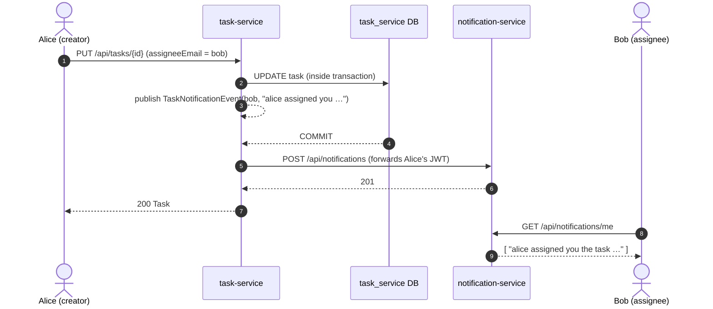

| Trigger | Who is notified | Message |
|---|---|---|
| Task created with an assignee, or the assignee changes | The new assignee (unless they assigned themselves) | `alice@acme.io assigned you the task "Order VFDs"` |
| The assignee changes the task's status | The task's creator | `bob@acme.io moved "Order VFDs" to In progress` |

**Why after commit?** If the notification were sent inside the transaction and the transaction then rolled back, someone would be told about a change that never happened. `@TransactionalEventListener` prevents that.

**Why best-effort?** Delivery errors are logged and swallowed, so an outage of notification-service never fails or rolls back a task change. A durable outbox with retries is the natural next step (see the [roadmap](#known-limitations-and-roadmap)).

---

## Data model

Each table lives in its own service's database. There are no foreign keys across services. Records refer to users by email and to projects by UUID.

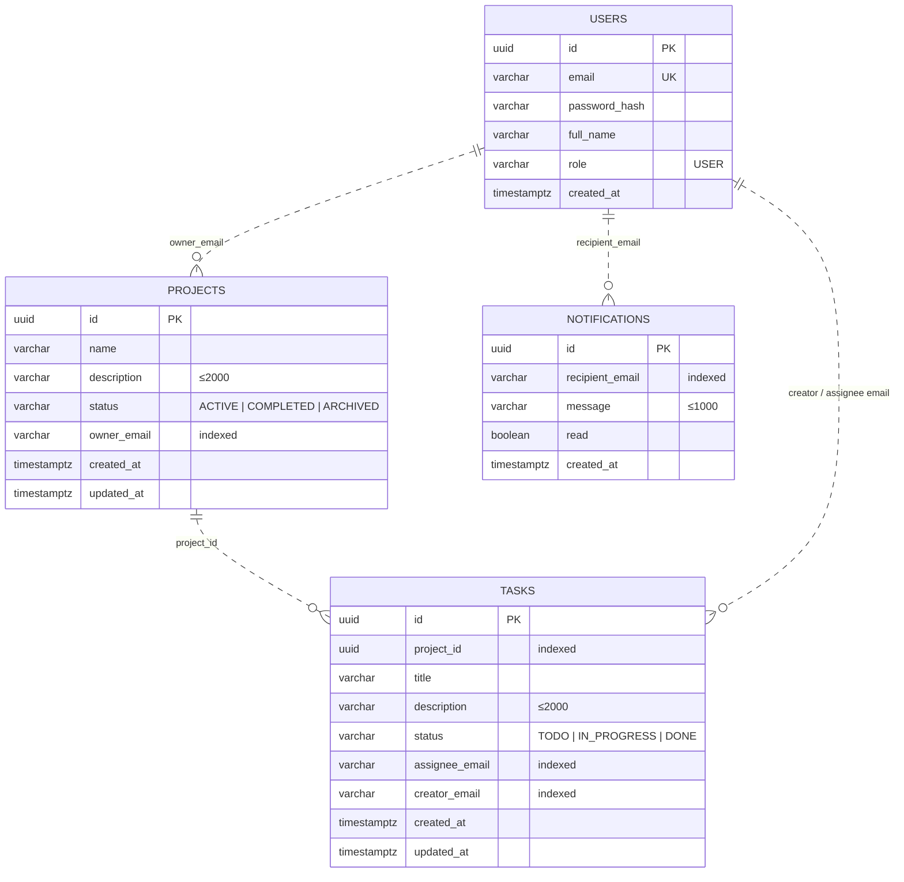

The dotted lines are logical relationships between services, not database constraints. Schemas are created by Flyway (`src/main/resources/db/migration/V1__*.sql` in each service). Hibernate only *validates* them (`ddl-auto: validate`).

---

## Frontend architecture

```
frontend/src/app/
├── core/
│   ├── auth.service.ts          token + signals (email, displayName, user profile)
│   ├── auth.interceptor.ts      adds the bearer token; on 401 → sign out + redirect with returnUrl
│   ├── auth.guard.ts            authGuard (app pages) / guestGuard (login, register)
│   ├── project|task|notification.service.ts   typed HTTP clients
│   ├── toast|confirm|theme.service.ts         UI services built on signals
│   ├── http-error.ts            turns HTTP failures into user-friendly messages
│   └── models/                  TypeScript interfaces + status labels
├── shared/                      modal, icon, avatar, toasts, confirm dialog, time-ago pipe,
│                                project-form & task-form dialogs, auth layout
├── layout/shell.component.*     sidebar, mobile drawer, user menu, unread badge polling
└── pages/                       one lazy-loaded folder per route
```

| Route | Page |
|---|---|
| `/login`, `/register` | Split-screen auth pages |
| `/dashboard` | Overview and key figures |
| `/projects` | Project cards with progress, filters and actions |
| `/projects/:id` | Kanban board |
| `/my-tasks` | Tasks across all projects |
| `/notifications` | Notification centre |
| `**` | 404 page |

**Patterns worth noting**
- **Signals everywhere** for component state (`signal`, `computed`). Every component uses `ChangeDetectionStrategy.OnPush`.
- **Optimistic updates.** Drag and drop and inline status changes update the screen first, then call the API, and roll back with a toast if the call fails.
- **One request per collection.** Progress for every project is computed from a single `GET /api/tasks` call instead of one call per project.
- **Accessibility.** Labelled controls, `aria-live` toasts, a focus-trapping modal that restores focus, keyboard-openable task cards, `prefers-reduced-motion` support, and task-status colours checked for colour-blind safety, always paired with text labels.
- **Theming.** CSS custom properties on `:root`, with a dark palette applied by OS preference or the user's choice. A small inline script applies the saved theme before Angular boots, so the page never flashes the wrong theme.
- **Bundle size.** About 96 kB is transferred on first load. Every page is a lazy-loaded chunk.

---

## Testing

### Backend

```bash
cd task-service      # or auth-service, project-service, notification-service, api-gateway
mvn test
```

- **Unit tests** (`service/*Test.java`) use Mockito for business rules: ownership, assignee permissions, status parsing, and which notification events are published.
- **Integration tests** (`controller/*IntegrationTest.java`) run the full Spring context against a **real PostgreSQL started by Testcontainers**, including Flyway migrations, JWT filters and HTTP status codes. **Docker must be running.**

### Frontend

```bash
cd frontend
npm test -- --watch=false --browsers=ChromeHeadless
```

This covers token handling in `AuthService`, the auth interceptor (token attached, no token sent to login, session ended on `401`, failed logins left alone), the relative-time pipe, and the root component. If Karma can't find Chrome, set `CHROME_BIN=$(which google-chrome)` (or `chromium`).

### End to end

Before release, the full Docker stack was exercised in a real browser with two users. The run covered:
- route guard and `returnUrl`
- bad-login error
- register with automatic sign-in
- project and task creation
- drag and drop still saved after a reload
- project status change
- assignment notifications and the unread badge
- assignee status change with read-only details
- mark all as read
- rejected-token sign-out
- creator notified of the move
- dark mode
- no horizontal overflow at 390 px width
- the 404 page

There were zero console errors.

---

## DevOps: containers, Kubernetes, infrastructure

### Docker images
Every service has a **multi-stage Dockerfile**:
- **Java services:** `maven:3.9-eclipse-temurin-21` resolves dependencies (cached in their own layer) and builds the jar. The jar then runs on the slim `eclipse-temurin:21-jre-alpine`.
- **Frontend:** `node:20-alpine` runs `npm ci` and the production build, which is served by `nginx:1.27-alpine` with the SPA fallback and `/api` proxy from `frontend/nginx.conf`.

### Kubernetes (AWS EKS)
The [`kubernetes/`](./kubernetes) folder deploys the same topology to the `industry-platform` namespace:
- A ConfigMap for non-secret config and a Secret for the JWT key and database credentials.
- A Deployment and ClusterIP Service per backend service. Each has an init container that waits for Postgres, plus readiness and liveness probes.
- Postgres with a 2 Gi PersistentVolumeClaim, initialised with the same multi-database script used by Compose.
- `LoadBalancer` Services for `frontend` (port 80) and `api-gateway` (port 8080).
- Images are published as `abdedaym/<service>:latest`.

```bash
aws eks update-kubeconfig --region ap-south-1 --name virtualtechbox-cluster
kubectl apply -f kubernetes/
kubectl get pods -n industry-platform -w
kubectl get svc  -n industry-platform frontend    # EXTERNAL-IP = public URL
```

See [`kubernetes/README.md`](./kubernetes/README.md) for probes, resource limits and design notes.

### Infrastructure as code (Terraform, AWS `ap-south-1`)

| Stack | Provisions | Open ports |
|---|---|---|
| [`Terraform/Jenkins-SonarQube-VM`](./Terraform/Jenkins-SonarQube-VM) | EC2 (Ubuntu, 40 GB disk) with **Jenkins**, Docker, **SonarQube** (container on :9000) and **Trivy** image scanning, installed by `install.sh` | 22, 80, 443, 8080, 9000, 3000 |
| [`Terraform/Monitoring-Server`](./Terraform/Monitoring-Server) | EC2 with **Prometheus** (:9090) and **Node Exporter** (:9100); Grafana (:3000) setup steps are documented in `install.sh` | 22, 80, 443, 9090, 9100, 3000 |

```bash
cd Terraform/Jenkins-SonarQube-VM
terraform init && terraform plan && terraform apply
```

> Update the AMI ID, key-pair name and region in `main.tf` / `provider.tf` to match your AWS account before applying. Restrict the security-group CIDRs (currently `0.0.0.0/0`) for anything beyond a demo.

**Intended pipeline:** Jenkins checks out the repo → runs the tests → SonarQube analysis → builds the Docker images → Trivy scan → pushes to Docker Hub → `kubectl apply -f kubernetes/` and a rollout restart on EKS. Prometheus and Grafana monitor the servers.

---

## Troubleshooting

| Symptom | Fix |
|---|---|
| The UI loads but sign-in says *"Cannot reach the server"* | The backend is still starting. Wait about a minute after `docker compose up`, then check `docker compose ps` and `docker compose logs api-gateway auth-service`. |
| `port is already allocated` | Another process is using 4200, 8080–8084 or 5433. Stop it, or change the left-hand side of the `ports:` mapping in `docker-compose.yml`. |
| A service exits with a Flyway or connection error | Postgres wasn't ready or the data volume is from an old schema. Run `docker compose down -v && docker compose up -d --build` (**this deletes all data**). |
| Signed out unexpectedly | The token expired (60 min by default) or `JWT_SECRET` differs between services. Sign in again or align the secret. |
| Assignments don't create notifications | Check that `NOTIFICATION_SERVICE_URL` is set for task-service, and look for `Failed to deliver notification` in `docker compose logs task-service`. |
| Integration tests fail with *"Could not find a valid Docker environment"* | Testcontainers needs a running Docker daemon that your user can access. |
| `ng test` can't start Chrome | Set `CHROME_BIN` to your Chrome or Chromium binary and use `--browsers=ChromeHeadless`. |
| Changes to the frontend don't show in Docker | Rebuild the image with `docker compose up -d --build frontend`, then hard-refresh the browser. |

---

## Known limitations and roadmap

These are deliberate scope limits for this version:

- **Projects are single-owner.** Teammates see tasks assigned to them, but not the owner's project board. *Next:* project membership and roles.
- **Notification delivery is best-effort.** *Next:* a transactional outbox, or a message broker such as RabbitMQ or Kafka, with retries.
- **No user directory.** Assignees are typed as email addresses. *Next:* user search and autocomplete from auth-service.
- **Notifications use polling** every 30 s. *Next:* WebSocket or Server-Sent Events push.
- **Tokens use a shared secret and have no refresh token.** *Next:* asymmetric keys (RS256 with a JWKS endpoint) and refresh tokens.
- **Observability.** *Next:* Actuator health and metrics on every service, scraped by Prometheus, plus distributed tracing.
- **API docs.** *Next:* OpenAPI/Swagger UI per service, aggregated at the gateway.

---

## Contributing

`main` is protected and always deployable. All work goes through pull requests:

1. Branch from `main` using `feature/<name>`, `fix/<name>` or `docs/<name>`.
2. Make small, focused commits using [Conventional Commits](https://www.conventionalcommits.org/), for example `feat(task): …`, `fix(security): …` or `docs: …`. Each commit should build.
3. Run the tests for every module you touched (`mvn test`, `npm test`).
4. Push and open a pull request into `main`. It is merged after review.
